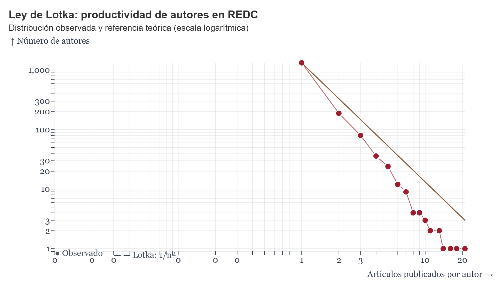

# Resumen

`Notebook Coding` es una colección de cuadernos abiertos y reproducibles,
escritos en JavaScript en la plataforma Observable [@observable2024]. Los
cuadernos calculan y visualizan indicadores bibliométricos para revistas
académicas indexadas en OpenAlex [@priem2022openalex] gestionadas mediante Open Journal Systems (OJS).

En lugar de depender exclusivamente de bases de datos comerciales de
citación, o dependencia de programas externos; cada cuaderno consulta directamente la API REST de OpenAlex
[@priem2022openalex]. Las celdas se reejecutan cuando se carga la
visualización, por lo que el panel refleja el estado disponible del índice de
OpenAlex en el momento de la consulta, y no una exportación estática
previamente generada.

El proyecto implementa catorce indicadores organizados en celdas
independientes y descriptivas:

- producción anual y citas recibidas;
- los diez trabajos más citados;
- cobertura de los Objetivos de Desarrollo Sostenible de las Naciones Unidas (ODS);
- cobertura de DOI y ORCID;
- estado de acceso abierto;
- procedencia geográfica e institucional de las obras citantes;
- tasa de autocitación;
- productividad de autores según la Ley de Lotka;
- h-index;
- i10-index;
- citación media a dos años;
- concentración de contribuciones autorales;
- concentración de contribuciones geográficas por país;
- concentración institucional de publicaciones;

Para las estadísticas propias de OJS, como vistas de página y descargas,
que no forman parte de la cobertura bibliográfica de OpenAlex, el caso de
estudio incorpora gráficos construidos con Datawrapper [@datawrapper2024].
Estas visualizaciones utilizan datos procedentes directamente del módulo de
estadísticas de OJS.

Cada indicador basado en OpenAlex puede integrarse en una instalación activa
de OJS mediante un `<iframe>` responsivo que apunte a una celda publicada de
Observable. También puede exportarse como una imagen estática en formato PNG
o SVG.

La reutilización del panel para otra revista requiere modificar cuatro
parámetros principales:

1. el identificador de fuente de la revista en OpenAlex;
2. una dirección de correo electrónico de contacto;
3. una clave de API de OpenAlex, cuando corresponda.
4. insertar el `<iframe>` en una ventana del editor de código `</>` de OJS.

El repositorio incluye un ejemplo de aplicación utilizando a la REDC como unidad
 de análisis y una guía técnica de inserción en OJS:

- *Revista Española de Documentación Científica*.

El código fuente está disponible en un repositorio público de GitHub
[@hernandezgutierrez2026github] y archivado en Figshare mediante el DOI
[10.6084/m9.figshare.33107114](https://doi.org/10.6084/m9.figshare.33107114)
[@hernandezgutierrez2026notebookcoding]. Los tres recursos se distribuyen bajo
la licencia MIT.

# Declaración de necesidad

Los equipos editoriales de revistas alojadas en OJS a nivel de América Latina y el Caribe [@willinsky2005open] rara
vez tienen acceso institucional a Scopus, Scimago Journal Rank o Web of
Science. Esta limitación de evaluación y posibilidad de análisis afecta especialmente a revistas de acceso abierto
que no están indexadas en bases de datos comerciales.

El módulo estadístico de OJS ofrece información sobre vistas de página y descargas conforme al estándar COUNTER dentro
de una instalación específica; sin embargo, estos datos no siempre garantizan continuidad histórica. Ante esta y otras
limitaciones que OJS aún presenta en materia de informes y analítica de rendimiento editorial particularmente en lo
relativo a indicadores bibliométricos, el presente estudio propone una solución alternativa.

Editores, bibliotecarios y estudiantes de bibliotecología y ciencias de la
información que desean aprender bibliometría aplicada suelen recibir
formación mediante interfaces propietarias o software que requiere instalación
o en algunos casos suscripciones costosas. Estas herramientas pueden ser
inaccesibles para las revistas pequeñas, las instituciones con recursos
limitados o los programas de formación que necesitan ejemplos reproducibles.

`Notebook Coding` cierra esa brecha para una audiencia específica y hasta ahora desatendida:
personas que dirigen o estudian una revista que no está indexada en una base de
datos comercial de referencia y que quieren un ejemplo trabajado y
bifurcable (forkable) de cómo los datos bibliográficos abiertos y las
herramientas de programación literaria abiertas pueden combinarse para
construir el mismo tipo de indicadores, con código fuente completamente
inspeccionable y resultados reproducibles. El proyecto está dirigido a
personas que administran o estudian revistas no indexadas en bases de datos
comerciales importantes y desean aprender a combinar:

- datos bibliográficos abiertos;
- APIs de consulta;
- programación literaria [@knuth1984literate];
- visualización interactiva;
- análisis bibliométrico reproducible.

Cada celda del cuaderno representa un indicador que se conecta con un endpoint de la API REST de OpenAlex,
tiene un nombre descriptivo y está organizada según sus dependencias de datos. Por ello, una clase o taller
puede utilizar un indicador individual como ejercicio autocontenido sin requerir que los estudiantes comprendan
inicialmente todo el flujo de trabajo.

# Métodos y fórmulas

Dado que la bibliometría basada en cuadernos de código es una metodología
relativamente poco conocida, esta sección documenta, fórmula por fórmula y
constante por constante, cómo se calcula realmente cada indicador y cómo
se construyen las consultas subyacentes a OpenAlex. La descripción incluye los supuestos,
constantes y limitaciones de cada procedimiento.

## Acceso controlado y tolerante a fallos

Las solicitudes a OpenAlex se gestionan mediante una cola de concurrencia
limitada. Esta cola utiliza un semáforo con un máximo de tres solicitudes
simultáneas: `maxConcurrent = 3`. Las solicitudes pendientes se mantienen en una cola FIFO (*first in, first
out*). De este modo, aunque varios indicadores soliciten datos al mismo
tiempo, el número de peticiones simultáneas no supera el límite establecido.

Cada solicitud incluye el parámetro `mailto`, que identifica al responsable
del uso de la API y permite acceder al denominado *polite pool*. Las
credenciales de acceso (`mailto` y `api_key`), cuando se utilizan, deben
almacenarse como secretos o variables de entorno, y no incluirse en texto
plano dentro del código publicado.

Cuando OpenAlex devuelve una respuesta HTTP `429`, la solicitud se reintenta
hasta seis veces. El tiempo de espera se define como:

$$
t_{\text{espera}}(k) =
\begin{cases}
1000 \cdot r & \text{si la respuesta trae un encabezado Retry-After } r \\
600 \cdot 2^{k} + u, \ u \sim \mathcal{U}(0,300)\text{ ms} & \text{en caso contrario}
\end{cases}
$$

donde:

- $k \in \{0,1,\ldots,5\}$ es el número del intento de reintento;
- $r$ es el valor, en segundos, indicado por `Retry-After`;
- $U(0,300)$ es un término aleatorio uniforme, expresado en
  milisegundos;
- el término aleatorio evita que varias solicitudes vuelvan a intentarse
  exactamente al mismo tiempo.

Esta estrategia corresponde a un esquema de retroceso exponencial con
variación aleatoria (*exponential backoff with jitter*).

## Recuperación exhaustiva del corpus

Los indicadores que necesitan detalle por artículo (productividad de autores, artículos más citados,
procedencia de las citas) no pueden depender solo de conteos agregados:
recorren todo el corpus de la revista mediante la paginación por cursor de
OpenAlex, comenzando en `cursor = "*"`, solicitando `per_page = 200`
trabajos por llamada, y continuando mientras exista `meta.next_cursor`. Una
revista con $N$ trabajos se recupera así en $\lceil N/200 \rceil$
solicitudes, cada una enrutada por la misma cola y lógica de reintento
descritas arriba.

Si una consulta recupera $N$ trabajos y la consulta utiliza un tamaño de
página $p$, el número aproximado de solicitudes es:

$$Q = \left\lceil \frac{N}{p} \right\rceil.$$

Para consultas generales, se recomienda utilizar el tamaño de página admitido
por la versión vigente de la API. La documentación actual de OpenAlex señala
que `per_page=100` es el máximo compatible para consultas generales, mientras
que las consultas agrupadas pueden devolver hasta 200 grupos y también pueden
paginarse mediante cursor [@openalexpaging2026; @openalexgrouping2026]. Cabe
señalar que las celdas de recuperación completa del corpus en este proyecto
solicitan `per_page=200`, un valor superior al límite general actualmente
documentado para el listado de trabajos; se recomienda verificar el valor
real de `meta.per_page` devuelto por la API antes de asumir que
$Q = \lceil N/p \rceil$ se cumple exactamente con $p=200$.

## Agregación en el servidor

Los indicadores que solo requieren conteos de frecuencia se calculan mediante
el parámetro `group_by` de OpenAlex. Entre ellos se incluyen:

- cobertura de los ODS;
- cobertura de DOI;
- cobertura de ORCID;
- estado de acceso abierto;
- concentración por autor;
- distribución por país;
- concentración institucional.

En estos casos, OpenAlex devuelve grupos con sus respectivos conteos. El
cuaderno transforma los grupos en estructuras adecuadas para las
visualizaciones.

Para un indicador de cobertura, la proporción se define como:

$$p = \frac{n_{\text{casos}}}{n_{\text{total}}}, \qquad p \in [0,1],$$

y el porcentaje que se muestra en el panel es

$$p_{\%} = 100 \cdot p.$$

Si $n_{\text{total}}=0$, el indicador se devuelve como no disponible y no
como cero, para evitar confundir ausencia de datos con ausencia del fenómeno.

## Productividad de autores y Ley de Lotka

El cuaderno identifica a cada autor mediante su identificador persistente de
OpenAlex y cuenta el número de trabajos de la revista en los que participa.

Sea $n$ el número de trabajos publicados por un autor. La distribución
observada se expresa como:

$$A_{\text{obs}}(n) = \left|\left\{a : \operatorname{works}(a)=n\right\}\right|.$$

La referencia teórica se basa en la Ley de Lotka [@lotka1926frequency]:

$$A_{\text{Lotka}}(n) = \frac{A(1)}{n^2}, \qquad n\geq 1,$$

donde $A(1)$ representa el número observado de autores con exactamente un
trabajo en la revista.

En este proyecto, $A(1)$ no se estima mediante regresión y el exponente
$2$ no se ajusta a los datos. Por tanto, el gráfico representa una
comparación pedagógica entre:

- la distribución observada $A_{\text{obs}}(n)$;
- la predicción de referencia $A_{\text{Lotka}}(n)$.

Esta decisión simplifica la interpretación para usuarios principiantes, pero
también constituye una limitación: el procedimiento no prueba que los datos
de la revista sigan estrictamente una distribución de Lotka.

## Tasa de autocitación

Para estimar la autocitación, el cuaderno selecciona los 50 trabajos más
citados de la revista. Para cada trabajo seleccionado, recupera las obras que
lo citan mediante una consulta equivalente a:

```text
filter=cites:OPENALEX_WORK_ID
```

Una obra citante se clasifica como autocitación de revista si su identificador
de fuente primaria coincide con el identificador de la revista analizada.

Sean $n_{\text{auto}}$ el número de citas provenientes de la misma revista, y
$n_{\text{ext}}$ el número de citas provenientes de otras revistas o fuentes.
La tasa de autocitación se calcula como:

$$SC = \frac{n_{\text{auto}}}{n_{\text{auto}}+n_{\text{ext}}} \times 100.$$

Si el denominador es cero, la tasa se reporta como no disponible.

Esta no es una tasa calculada sobre todo el corpus de la revista, sino sobre el
subconjunto de los 50 trabajos más citados. La decisión reduce el costo de
consultas a la API, pero limita la generalización del resultado. Por ello,
el indicador debe interpretarse como una estimación de autocitación entre los
trabajos de mayor impacto, no como una tasa corpus-wide.

## Indicadores precomputados

El h-index, el i10-index y la citación media a dos años se leen del campo
`summary_stats` del registro de fuente de OpenAlex. El cuaderno no recalcula
estos tres indicadores a partir de los conteos de citas por trabajo.

El h-index se define formalmente como:

$$h = \max\left\{k\in\mathbb{N} : \#\left\{w : c_w \geq k\right\}\geq k\right\},$$

donde $w$ representa un trabajo, $c_w$ es el número de citas recibidas por el
trabajo $w$, y $h$ es el mayor número de trabajos que tienen al menos $h$
citas.

El i10-index se define como:

$$i_{10} = \#\left\{w : c_w \geq 10\right\}.$$

La citación media a dos años puede expresarse, según el campo utilizado por
la fuente, como:

$$\overline{C}_{2} = \frac{\sum_{w\in W_{2}} c_w}{|W_{2}|},$$

donde $W_{2}$ representa el conjunto de trabajos considerados dentro de la
ventana de dos años.

En el notebook, estos valores se presentan como indicadores mantenidos por
OpenAlex. Esta decisión reduce la complejidad del código y facilita la
auditoría, pero implica confiar en el procedimiento de cálculo empleado por
OpenAlex. Por tanto, los valores no se verifican de manera independiente
contra todos los conteos de citas disponibles en el corpus descargado.

# Reproducibilidad y reutilización

La reproducibilidad depende de la disponibilidad de:

- la versión del código fuente;
- el identificador de la revista en OpenAlex;
- la fecha de consulta;
- los parámetros de filtrado;
- las respuestas devueltas por la API;
- las versiones de las bibliotecas JavaScript utilizadas.

Debido a que OpenAlex se actualiza continuamente, dos ejecuciones realizadas
en fechas diferentes pueden producir resultados distintos. Por ello, cada
ejecución debería documentar al menos:

```text
source_id
query_date
filter
mailto
api_version, si está disponible
code_version
```

Un ejemplo mínimo de configuración para reutilizar el panel es:

```js
const config = {
  sourceId: "s6910135",
  journalName: "Revista Española de Documentación Científica",
  startYear: 2010,
  endYear: 2026,
  mailto: "correo-institucional@example.org"
};
```

# Figuras

El panel combina series temporales, rankings, distribuciones y redes para que
cada indicador utilice una representación visual adecuada a su naturaleza.



# Limitaciones

El proyecto presenta varias limitaciones que deben considerarse al interpretar
los resultados:

- OpenAlex no representa necesariamente todo el contenido publicado por una
  revista.
- La cobertura puede variar según el reconocimiento de DOI, autores,
  afiliaciones y fuentes.
- Los identificadores de autor pueden estar incompletos o duplicados.
- La tasa de autocitación se calcula sobre los 50 trabajos más citados y no
  sobre todo el corpus.
- El gráfico de Lotka utiliza el exponente clásico $2$ sin estimarlo mediante
  regresión.
- Los índices de resumen se leen de `summary_stats` y no se recalculan
  independientemente.
- Los resultados pueden cambiar cuando OpenAlex actualiza sus registros.
- Las estadísticas de uso de OJS y los indicadores bibliométricos de OpenAlex
  miden fenómenos diferentes y no deben interpretarse como equivalentes.

# Agradecimientos

Agradecemos a las comunidades de OpenAlex, Observable,
Datawrapper y Open Journal Systems. Sus APIs abiertas y herramientas de libre
acceso hacen posible construir paneles bibliométricos reproducibles sin
depender de una suscripción comercial de datos.

# Referencias
